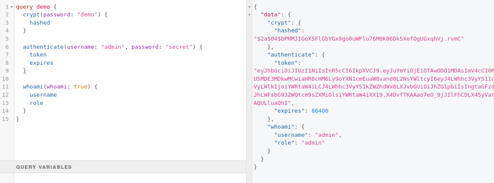
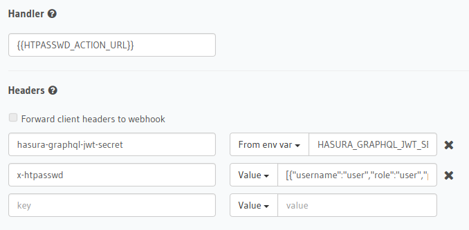
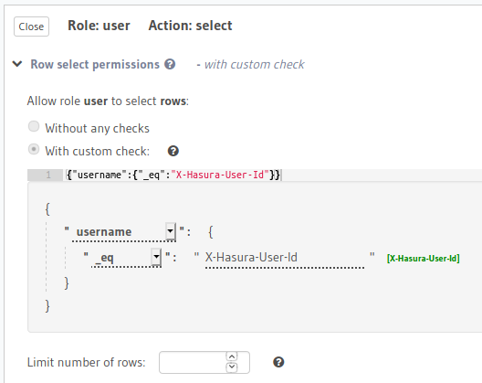

# htpasswd for Hasura

Manage authentication using actions and headers inside Hasura.
Inspired by the htpasswd tool that manages authentication using flat files.
This can be useful if your app doesn't need a full authentication system,
but you still want logins for the admin interface.



These are [Action Handlers](https://hasura.io/docs/1.0/graphql/manual/actions/action-handlers.html)
that process http POST requests to parse and generate json.
This adds graphql queries for `crypt`, `authenticate` and `whoami`.
The code itself is written in the [Go programming language](https://tour.golang.org/).

The tool allows setting up a static list of users with passwords and roles
for [authorization](https://hasura.io/docs/1.0/graphql/manual/auth/authorization/index.html).
The default database contains users and roles with password `secret`.
The users `user`, `manager` and `admin` are available for experiments with the permissions system.
The database itself can be overridden by sending a `x-htpasswd` header that
contains a json array of entries with hashed passwords for example:

```json
[{"username":"sander","role":"sander","password":"$2a$04$w74Ln7rj8W/6MCONQcwfteABAzxWfjDDyLj1RhQpf.J8by2aG9CCq"}]
```

The action handler can be set to `{{HTPASSWD_ACTION_URL}}` and this can be
configured in your environment variables using a value like `http://localhost:8181/api`.



- The JWT token that is generated requires the secret from Hasura in a header and the tokens expire in 24 hours.
- When localhost is not available you can use [ngrok](https://ngrok.com/) to make a tunnel `ngrok http 8181` and use the url that it prints on start.

The access token can be used as header in subsequent graphql requests and you can use it to setup permissions on tables:



## Running

```bash
# building and running
go build cmd/server/server.go && ./server

# development
go run cmd/server/server.go

# testing
go test ./...
```

## Demo

```graphql
query demo {
  crypt(password: "demo") {
    hashed
  }

  authenticate(username: "admin", password: "secret") {
    token
    expires
  }

  whoami(whoami: true) {
    username
    role
  }
}
```

## Crypt

Crypt a password or error on empty string.

```graphql
type Query {
  crypt (
    password: String!
  ): CryptOutput!
}

type CryptOutput {
  hashed : String!
}
```

## Authenticate

Authenticate a user against the user database and return the token.
Will error on invalid authenication.

*Required*

- `hasura-graphql-jwt-secret` header from env var `HASURA_GRAPHQL_JWT_SECRET` (only type and key attributes
are used, type can be HS256/HS384/HS512)

*Optional*

- `x-htpasswd` contains the user, role password entries in json format (this overrides the default database)
- `x-debug` set to true to enable logging of the action/input/session variables

```graphql
type Query {
  authenticate (
    username: String!
    password: String!
  ): AuthOutput
}

type AuthOutput {
  token : String!
  expires : Int!
}
```

## Whoami

Prints the username and role based upon the session variables `x-hasura-user-id` and `x-hasura-role`.
The boolean input is not used but an input is manditory.

```graphql
type Query {
  whoami (
    whoami: Boolean
  ): WhoamiOutput
}

type WhoamiOutput {
  username : String!
  role : String!
}
```
